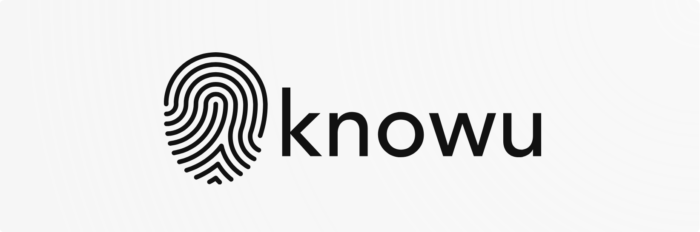

# knowu

[](https://www.npmjs.com/package/knowu)
[](LICENSE)
[](./knowu.png)
**knowu** is a comprehensive browser fingerprinting library with a builder API. It collects a wide range of signals (canvas, WebGL info & extensions, fonts, screen, timezone, languages, plugins, audio fingerprint, hardware concurrency, device memory, CPU class, platform, color gamut, contrast, forced/inverted colors, monochrome depth, storage support, DOM blockers, PDF viewer enabled, architecture, Apple Pay, private click measurement, reduced motion/transparency, vendor info/flavors, math fingerprint, touch support, etc.) and provides an easy-to-use API for recording and sending fingerprints.

The library is built in pure JavaScript, bundled with Bun’s built‑in bundler, and is published for use via a CDN.

## Features

- **Comprehensive Fingerprinting:** Gathers dozens of browser signals.
- **Builder API:** Easily record and send fingerprints.
- **Browser Bundles:** Provides both ESM and IIFE builds for modern and legacy browsers.
- **Lightweight & Fast:** Bundled and minified for performance.

## Installation

You can install via Bun (or npm if desired):

```bash
bun install knowu
```

Or, if you prefer to use the library via a CDN, once published you can reference the bundle via services like unpkg or jsDelivr.


## Usage

The library exposes a global class Knowu. For example, include the UMD bundle in your HTML page:
```html
<!DOCTYPE html>
<html lang="en">
<head>
  <meta charset="UTF-8" />
  <title>Knowu Example</title>
  <script src="https://unpkg.com/knowu/dist/knowu.umd.js"></script>
</head>
<body>
  <script>
    // Create an instance pointing to your backend endpoint
    const knowu = new Knowu("https://your-backend.example.com/fingerprint", { sendOnLoad: false });
    
    // Record a fingerprint and then send it
    knowu.record().then(fp => {
      console.log("Fingerprint:", fp);
      knowu.send(fp).then(response => {
        console.log("Fingerprint sent:", response);
      });
    });
  </script>
</body>
</html>
```

## License

This project is licensed under the GPL-3 license.
